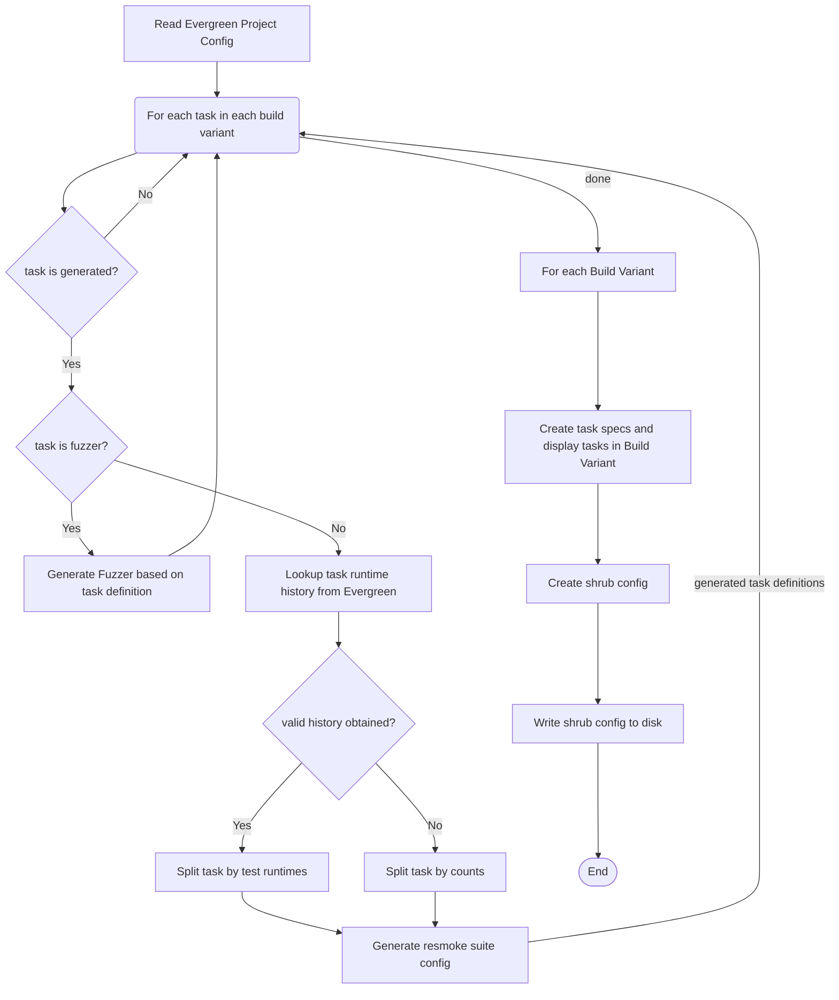

# Mongo Task Generator

Dynamically split evergreen tasks into subtasks for testing the mongodb/mongo project.

## Table of contents

- [Mongo Task Generator](#mongo-task-generator)
  - [Table of contents](#table-of-contents)
  - [Description](#description)
  - [Getting Help](#getting-help)
    - [What's the right channel to ask my question?](#whats-the-right-channel-to-ask-my-question)
    - [How can I request a change/report a bug in _Mongo Task Generator_?](#how-can-i-request-a-changereport-a-bug-in-mongo-task-generator)
    - [What should I include in my ticket or question?](#what-should-i-include-in-my-ticket-or-question)
  - [Dependencies](#dependencies)
  - [Installation](#installation)
  - [Usage](#usage)
  - [Documentation](#documentation)
  - [Contributor's Guide](#contributors-guide)
    - [High Level Architecture](#high-level-architecture)
    - [Setting up a local development environment](#setting-up-a-local-development-environment)
    - [linting/formatting](#lintingformatting)
    - [Running tests](#running-tests)
    - [Versioning](#versioning)
    - [Code Review](#code-review)
    - [Deployment](#deployment)
  - [Resources](#resources)

## Description

A tool to dynamically generate and split resmoke tests for the mongodb/mongo project into sub-tasks
that can be run in parallel. For example, a task that runs in 2 hours could be split into 4 sub-tasks
that can be run in parallel to reduce the wall-clock time of to closer to 30 minutes.

The tool will use [Evergreen Test Stats](https://github.com/evergreen-ci/evergreen/wiki/REST-V2-Usage#teststats)
to determine how to divide the tests between sub-tasks. If test stats are not available for any
reason, it will fallback to splitting tests so that each sub-tasks contains an equal number of tests.

The tool will generate fuzzer tasks as well. In the case of fuzzer tasks, the generation
determines the amount of fuzzer tests to generate. There are two controls for how many fuzzer tests
to generate, `n_files` and `n_tasks`. They should be specified in the task definition in the evergreen
config file. `n_files` controls how many fuzzer files will be generated in each sub-task, effectively
controlling the runtime of each subtask. `n_tasks` controls how many sub-tasks will be generated.
For example, if `n_files=3` and `n_tasks=5`, a total of 15 files will be run in 5 sub-tasks.

## Getting Help

### What's the right channel to ask my question?

If you have a question about _Mongo Task Generator_, please reach out on slack in the #server-testing
channel, or email us at dev-prod-dag@mongodb.com.

### How can I request a change/report a bug in _Mongo Task Generator_?

Create a [DAG ticket](https://jira.mongodb.org/browse/DAG) in Jira.

### What should I include in my ticket or question?

Please include as much information as possible. This can help avoid long information-gathering threads.

Please include the following:

* **Motivation for Request**: Why is this change being requested? (This help us understand the priority and urgency of the request)
* **Context**: Is there any background information we should be aware of for this request?
* **Description**: What would you like investigated or changed?

## Dependencies

This project is built to run on linux. It is tested on Ubuntu 18.04.

The [evergreen CLI](https://github.com/evergreen-ci/evergreen/wiki/Using-the-Command-Line-Tool) is
required.

## Installation

The tool can be downloaded from the [github releases](https://github.com/mongodb/mongo-task-generator/releases)
page. It is currently built on Ubuntu 18.04 and should work on recent x86 linux distributions.

The install can be automated using a tool like `wget` or `curl`:

```bash
wget https://github.com/mongodb/mongo-task-generator/releases/download/v0.1.0/mongo-task-generator
```

## Usage

To generate the task information, run the `mongo-task-generator` command at the root of the
mongodb repository. The generated configuration will be created in the `generated_resmoke_config`
directory. The `evergreen_config.json` file in that directory should be passed to evergreen as
part of a [`generate.tasks`](https://github.com/evergreen-ci/evergreen/wiki/Project-Commands#generatetasks)
command call.

```bash
mongo-task-generator

USAGE:
    mongo-task-generator --evg-project-file <EVG_PROJECT_FILE> --expansion-file <EXPANSION_FILE> --evg-auth-file <EVG_AUTH_FILE>

OPTIONS:
        --evg-auth-file <EVG_AUTH_FILE>
            File with information on how to authenticate against the evergreen API

        --evg-project-file <EVG_PROJECT_FILE>
            File containing evergreen project configuration

        --expansion-file <EXPANSION_FILE>
            File containing expansions that impact task generation

    -h, --help
            Print help information
```

## Documentation

See [Generating tasks](docs/generating_tasks.md) for details on how task generation works.

## Contributor's Guide

### High Level Architecture

Flow chart of generating tasks:



### Setting up a local development environment

Make sure you have a rust development environment installed. See instructions [here](https://www.rust-lang.org/learn/get-started).

From the root of the repository, run `cargo build` to build the project.

### linting/formatting

```bash
cargo fmt
cargo clippy
```

### Running tests

```bash
cargo test
```

### Versioning

This project uses [semver](https://semver.org/) for versioning.

Please include a description what is added for each new version in `CHANGELOG.md`.

### Code Review

This project uses the [Evergreen Commit Queue](https://github.com/evergreen-ci/evergreen/wiki/Commit-Queue#pr).
Add a PR comment with `evergreen merge` to trigger a merge.

### Deployment

Deployment is done via github actions. Deployment can be triggered via a git tag. To create a
deployment, tag the commit you wish to deploy with a git tag and push the tag to the remote
repository.

The git tags should be formatted as follows: "v" followed by the 3 number version being deployed.
For example, "v0.1.0".

```bash
git tag v0.1.0
git push origin --tags
```

The tagged version will be deployed to the [github release](https://github.com/mongodb/mongo-task-generator/releases)
for the project.

## Resources

- [Evergreen generate.tasks documentation](https://github.com/evergreen-ci/evergreen/wiki/Project-Commands#generatetasks)
- [Evergreen test stats documentation](https://github.com/evergreen-ci/evergreen/wiki/REST-V2-Usage#teststats)
